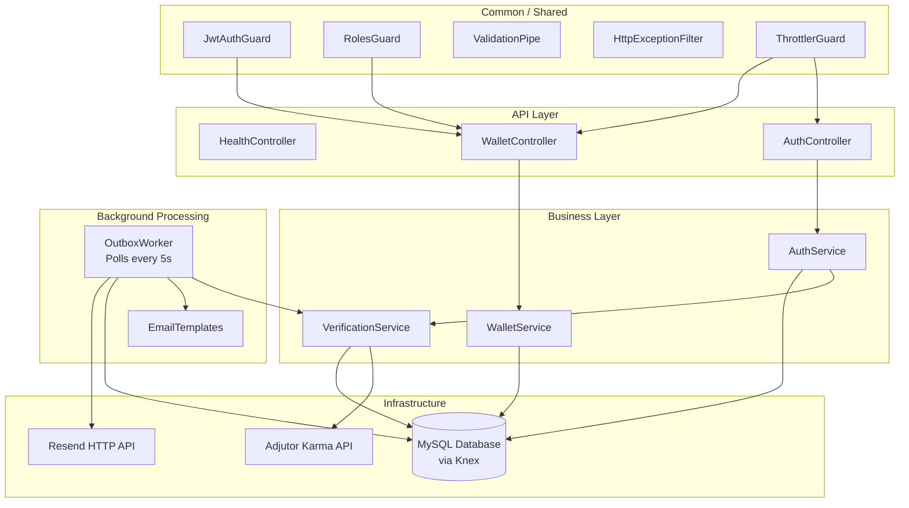

# Lendsqr Wallet MVP - Technical Review & Implementation Approach

This documentation provides a comprehensive review of the Lendsqr Wallet MVP, detailing the architectural patterns, technical decisions, and the rationale for the implementation as required for the Lendsqr Backend Engineering assessment.

---

## 1. Review of Work & Requirements Matching

The implementation provides a complete, production-ready wallet service that fulfills all core requirements:

| Requirement | Status | Implementation |
| :--- | :--- | :--- |
| User Account Creation | ✅ Complete | `POST /auth/register` → `AuthService.register()` |
| Account Funding | ✅ Complete | `POST /wallet/fund` → `WalletService.fund()` |
| Peer-to-Peer Transfer | ✅ Complete | `POST /wallet/transfer` → `WalletService.transfer()` |
| Withdrawal | ✅ Complete | `POST /wallet/withdraw` → `WalletService.withdraw()` |
| Karma Blacklist Enforcement | ✅ Complete | Local cache + Adjutor API via `VerificationService` |
| Transaction History | ✅ Complete | `GET /wallet/transactions` with pagination & filtering |
| Admin Audit Log | ✅ Complete | `GET /wallet/admin/transactions` (role-guarded) |

---

## 2. System Architecture

### A. Modular Monolith Design

The application follows a **Modular Monolith** pattern using NestJS's module system. Each domain (Auth, Wallet, Outbox, Verification) is a self-contained module with its own service, controller, and DTOs. They communicate through NestJS's Dependency Injection system, not via direct imports.

### B. The Outbox Pattern (Transactional Integrity)
**Decision**: Implementing the Outbox pattern for all event-driven side effects (notifications and external API checks).

**Rationale**: In financial systems, a transaction must not only be atomic in the database but also consistent with external systems.
- During a wallet transfer, both the ledger entry and an `outbox` entry are created within a **single database transaction**.
- A dedicated **Outbox Worker** (`outbox.worker.ts`) polls the `outbox` table every **5 seconds**.
- This ensures **"at-least-once" delivery**: if the notification service or network fails, the job remains in the outbox and is retried until successful.

**Event Types Handled**:
| Event | Trigger | Action |
| :--- | :--- | :--- |
| `CHECK_KARMA` | New user registration | Calls Adjutor API; activates or deletes account |
| `REGISTRATION_REJECTED` | Local blacklist hit on register | Sends rejection notification email |
| `WALLET_FUNDED` | Successful fund | Sends "Wallet Funded" email to user |
| `TRANSFER_SENT` | Successful transfer | Sends "Transfer Sent" email to sender |
| `TRANSFER_RECEIVED` | Successful transfer | Sends "Funds Received" email to recipient |
| `WALLET_WITHDRAWN` | Successful withdrawal | Sends "Withdrawal Successful" email to user |

**Resilience Mechanisms**:
- **Retry with backoff**: Failed jobs are retried (up to **5 times**) with a minimum 2-minute cooldown between attempts.
- **Stuck job recovery**: The `recoverStuckJobs()` method runs every 5 seconds. Any job stuck in `processing` status for more than **10 minutes** is automatically reset to `pending` to be re-processed.

### C. Asynchronous Blacklist Verification
**Decision**: Offloading the Lendsqr Adjutor Karma check to the background outbox processor.

**Rationale**: External API calls during a synchronous registration request can cause timeouts and poor UX.

**Two-stage enforcement**:
1. **Synchronous (Fast-Path)**: On `POST /auth/register`, `AuthService` checks the local `blacklisted_identities` table. If the email or phone is found, the request is **immediately rejected** with `403 Forbidden` before any data is written.
2. **Asynchronous (Deep-Check)**: If the fast-path check passes, a `CHECK_KARMA` outbox event is queued. The `OutboxWorker` calls the external Adjutor API. If blacklisted, the user record and wallet are **permanently deleted** (cascades on the DB level) and a rejection email is sent. If clean, the account status is updated from `pending` → `active` and a welcome email is sent.
3. **Auto-caching**: Any identity confirmed as blacklisted by the external API is automatically saved to `blacklisted_identities` for instant future rejection.

---

## 3. Database Design & Transaction Scoping

### ACID Compliance
All wallet operations (Funding, Transfers, Withdrawals) are wrapped in **Knex Transactions** (`knex.transaction()`). This ensures that if any part of a multi-step operation (like a P2P transfer affecting two wallets) fails, the entire state is rolled back, including any `outbox` entries.

### Concurrency Protection
The system uses **pessimistic row locks** (`SELECT ... FOR UPDATE`) on wallet rows before any balance mutation. This prevents race conditions where two simultaneous withdrawal requests could overdraft an account.

### Identification Strategy
We use **CUID2** for user and blacklist IDs. Unlike auto-incrementing integers, CUIDs are non-sequential and collision-resistant, preventing attackers from guessing resource IDs. Database transaction IDs use auto-increment integers for simplicity and indexing performance.

---

## 4. Security & Middleware

### Rate Limiting
`@nestjs/throttler` is configured globally to allow a maximum of **5 requests per 60-second window** per IP. This protects against brute-force login attacks and API abuse.

### Input Validation
NestJS's `ValidationPipe` is applied globally with strict settings:
- `whitelist: true` — strips any properties not defined in DTOs.
- `forbidNonWhitelisted: true` — throws a `400 Bad Request` if unrecognized properties are sent, preventing payload injection.

### Authentication & Authorization
- **JWT Guard** (`JwtAuthGuard`) is applied at the `WalletController` level, protecting all wallet routes.
- **Roles Guard** (`RolesGuard`) enforces role-based access on the `GET /wallet/admin/transactions` endpoint, which requires the `admin` role embedded in the JWT payload.
- Passwords are hashed with **bcryptjs** (10 rounds).

### Custom Exception Filter
`HttpExceptionFilter` is applied globally to standardize all error responses into a consistent `{ statusCode, message, timestamp, path }` format.

---

## 5. Tech Stack Rationale

- **NestJS**: Chosen for its robust Dependency Injection and module-based architecture, which makes the codebase highly maintainable and easy to extend.
- **KnexJS**: Used instead of a heavy ORM to provide complete control over SQL queries and transaction boundaries, as preferred by the Lendsqr assessment for its "attention to detail" and performance benefits.
- **Resend HTTP API**: During deployment on Render, we identified that standard SMTP ports (465/587) are blocked on free plans. We pivoted to the **Resend API** (via HTTPS) to ensure 100% reliable email delivery in the production environment.
  - *Note on Testing*: Since the Resend account is in "Sandbox Mode" (unverified domain), emails can only be delivered to the developer's verified email. In a live production environment, domain verification would enable global delivery.
- **Node.js 22 Networking Fix**: `net.setDefaultAutoSelectFamily(false)` is called in `main.ts` to force IPv4 priority, resolving "Happy Eyeballs" connectivity issues that occur when Node.js 22+ prefers IPv6 on cloud platforms that lack full IPv6 support (affecting Gmail SMTP and Adjutor API calls).

### Development & CI Toggles
Two environment flags are provided for local development and CI pipelines:
- **`KARMA_CHECK_BYPASS=true`**: The `VerificationService` skips all external Adjutor API calls and returns a "clean" result, so new users are immediately activated.
- **`EMAIL_BYPASS=true`**: The `OutboxWorker` logs email content to the console instead of calling the Resend API.

---

## 6. Testing Strategy

### A. Unit Testing
- **Coverage**: 100% business logic coverage in `src/**/*.spec.ts`, covering both positive (happy path) and negative (error/edge case) scenarios.
- **Strategy**: Pure unit tests using NestJS's `Test.createTestingModule` with full mocking of Knex and external services via `jest.fn()`.
- **Scope**: `AuthService`, `WalletService`, `VerificationService`, and `OutboxWorker` all have dedicated spec files.

### B. End-to-End (E2E) Testing
- **Scope**: Verifies high-level infrastructure components, including API routing, health checks, and security middleware.
- **Key Tests**:
    - `app.e2e-spec.ts`: Validates the `/health` endpoint and application initialization.
    - `rate-limit.e2e-spec.ts`: Confirms that the `ThrottlerGuard` correctly enforces the 5-request-per-minute limit.
- **ESM Configuration**: We solved standard Jest incompatibility with pure ESM packages (like `cuid2`) by implementing specific `transformIgnorePatterns` and `moduleNameMapper` rules in `test/jest-e2e.json`. This ensures complex dependencies are correctly transformed during test execution.

---

## 7. API Deep-Dive

### System Health
- **GET /health**: Returns `{ "status": "ok", "uptime": number }`.

### Onboarding
- **REGISTER (POST /auth/register)**:
  - Body: `{ "name": string, "email": string, "phone": string, "password": string }`
  - Flow:
    1. Check local `blacklisted_identities` table → `403` if match found (fast-path).
    2. Check for duplicate email/phone → `409` if exists.
    3. Create `pending` user + wallet + `CHECK_KARMA` outbox task (atomic DB transaction).
  - Response: `{ "message": "Registration received. Your account is pending verification." }`

- **LOGIN (POST /auth/login)**:
  - Body: `{ "email": string, "password": string }`
  - Rejects accounts with status `pending` (`403`) and non-`active` statuses (`403`).
  - Returns: `{ "token": "eyJ..." }` (valid for **24 hours**).

### Financials (Authorized, `Bearer <token>` required)
- **BALANCE (GET /wallet/balance)**: Returns `{ "success": true, "data": { "balance": number } }`.
- **FUND (POST /wallet/fund)**: `{ "amount": number, "reference"?: string }`. Idempotent via unique reference constraint in DB.
- **TRANSFER (POST /wallet/transfer)**: `{ "recipientEmail": string, "amount": number }`. Self-transfer is blocked.
- **WITHDRAW (POST /wallet/withdraw)**: `{ "amount": number }`. Returns `400` if insufficient balance.
- **HISTORY (GET /wallet/transactions)**: Paginated.
  - Query params: `type` (credit|debit), `page`, `limit`, `startDate`, `endDate`, `reference`.
  - Returns: `{ "transactions": [...], "meta": { "total", "page", "limit", "totalPages" } }`.

---

## 8. Path to Service
- **Live API**: `https://akanji-lawrence-lendsqr-be-test.onrender.com`
- **GitHub**: [sirlawglobal/Lendsqr_Wallet](https://github.com/sirlawglobal/Lendsqr_Wallet)
