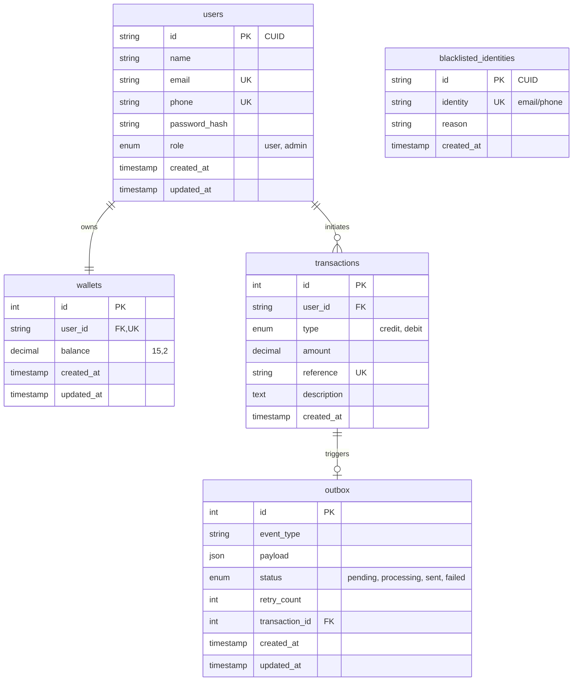

# Lendsqr Wallet MVP

A Minimum Viable Product (MVP) wallet service built as part of the Lendsqr engineering assessment. It provides core functionality for user onboarding, funding, transfers, and withdrawals, paired with faux token-based authentication and integration with the Lendsqr Adjutor Karma blacklist API.

## Core Features
1. **User Onboarding & Authentication**: Account creation with validation. Users listed in the Lendsqr Adjutor Karma blacklist are structurally denied onboarding. Includes faux token-based auth using JWTs.
2. **Wallet Management**: Every user has an auto-provisioned wallet upon registration.
3. **Account Funding**: Users can fund their wallets.
4. **Peer-to-Peer Transfers**: Users can transfer funds between their wallets and other users' wallets via email.
5. **Withdrawals**: Users can withdraw funds from their wallets.

---

## Tech Stack
- **Framework**: [NestJS](https://nestjs.com/) v11 (Node.js/TypeScript)
- **Database**: MySQL 8.0
- **Query Builder**: [KnexJS](https://knexjs.org/)
- **Authentication**: JWT (Passport-like strategy with `bcryptjs` for hashing)
- **External API**: Lendsqr Adjutor Karma API (Parallel email/phone verification)

- **Event Handling**: Outbox Pattern for reliable transactional messaging
- **Validation**: `class-validator` & `class-transformer`
- **Testing**: Jest (Unit & Integration)

---

## E-R Diagram (Database Schema)

The database architecture is designed for scalability and reliability, incorporating an Outbox pattern for event-driven consistency and a local blacklist table for identity verification.



---

## Setup & Running Locally

### 1. Prerequisites
- Docker & Docker Compose (for the MySQL database)
- Node.js (LTS recommended)
- npm or yarn

### 2. Environment Configuration
Clone the repository, verify `.env` is setup. A sample `.env.example` has been provided.

```bash
cp .env.example .env
```
Ensure you add your actual Adjutor API Key to `ADJUTOR_API_KEY`.

### 3. Start Database (Docker)
A `docker-compose.yml` file is provided to spin up MySQL and phpMyAdmin.

```bash
docker-compose up -d
```

### 4. Install Dependencies
```bash
npm install
```

### 5. Run Database Migrations
Run the Knex migrations to scaffold the tables.
```bash
npm run migrate
```

### 6. Start the Server
```bash
# development mode
npm run start:dev
```

The server will be available at `https://akanji-lawrence-lendsqr-be-test.onrender.com`.

---

## Testing

The project has comprehensive unit tests covering positive and negative edge cases across authentication, JWT validation, verification (Karma API), and wallet transactions (fund, transfer, withdraw, concurrency protection).

```bash
# run unit tests
npm test
```

---

## API Documentation

### Authentication

**1. Register Account**
- `POST /auth/register`
- Body: `{ "name": "John Doe", "email": "john@doe.com", "phone": "08012345678", "password": "securepassword" }`
- Note: Registration will fail if the phone number is on the Adjutor Karma Blacklist.

**2. Login**
- `POST /auth/login`
- Body: `{ "email": "john@doe.com", "password": "securepassword" }`
- Returns: `{ "token": "jwt..." }`

### Wallet Operations (Requires Authorization Header)
Include the JWT token in the headers for all wallet routes: `Authorization: Bearer <token>`

**1. Get Balance**
- `GET /wallet/balance`
- Returns current wallet balance.

**2. Fund Wallet**
- `POST /wallet/fund`
- Body: `{ "amount": 1000, "reference": "opt_ref_123" }`

**3. Transfer Funds**
- `POST /wallet/transfer`
- Body: `{ "recipientEmail": "jane@doe.com", "amount": 500 }`
- Note: Checks sender balances to prevent overdawing, explicitly prevents self-transfers, records 2 transaction ledger entries.

**4. Withdraw Funds**
- `POST /wallet/withdraw`
- Body: `{ "amount": 250 }`

### Transaction History (Requires Authorization Header)

**1. Personal Transactions**
- `GET /wallet/transactions`
- Optional Query Parameters:
  - `type`: "credit" or "debit"
  - `page`: Page number (default: 1)
  - `limit`: Results per page (default: 10)
  - `startDate`: Filter by start date (ISO string)
  - `endDate`: Filter by end date (ISO string)
  - `reference`: Exact match for transaction reference

**2. All Transactions (Admin Only)**
- `GET /wallet/admin/transactions`
- Accessible only by users with the `admin` role. Supports same query parameters as above.
