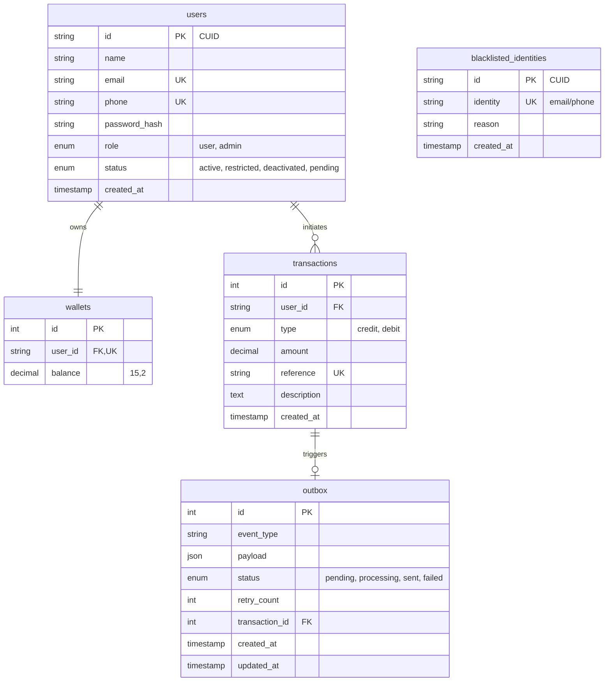

# Lendsqr Wallet MVP - Design Document

## 1. Project Overview
Demo Credit is a mobile lending application requiring robust wallet functionality. This service provides the Minimum Viable Product (MVP) core: user onboarding with automated blacklist verification, wallet funding, peer-to-peer transfers, and withdrawals.

### Core Features
- **Automated Onboarding**: New users are verified against the **Lendsqr Adjutor Karma API** in the background. Accounts start as `pending` and are activated (or permanently deleted and rejected) after verification.
- **Early Blacklist Rejection**: Proactive check against a local `blacklisted_identities` cache to immediately block repeat offenders with a `403 Forbidden` before any data is written.
- **Transaction Integrity**: Uses the **Outbox Pattern** with **Resend HTTP Email API** to ensure reliable data consistency between wallet balances and external notifications.
- **Wallet Operations**: Secure funding, transfers, and withdrawals with full ACID compliance and pessimistic row-level locking (`FOR UPDATE`).
- **Transaction History**: Comprehensive filtering and pagination for user and admin audit trails.
- **Rate Limiting**: Global throttle of **5 requests per minute per IP** to prevent abuse.
- **Input Validation**: Global `ValidationPipe` enforces strict DTOs — unknown properties are rejected (`forbidNonWhitelisted: true`).

---

## 2. Technical Stack & Rationale
| Component | Technology | Rationale |
| :--- | :--- | :--- |
| **Language** | TypeScript | Type safety and enhanced developer productivity for financial logic. |
| **Framework** | NestJS (v11) | Structured patterns (DI, Modules) promoting high code quality and testability. |
| **Database** | MySQL 8.0 | Reliable, relational ACID-compliant storage for financial ledgers. |
| **Query Builder** | KnexJS | Assessment-preferred choice; provides granular SQL control and efficient migrations without the overhead of a heavy ORM. |
| **Auth** | JWT | Stateless, secure authentication strategy. Tokens expire in **24 hours**. |
| **ID Generation** | CUID2 | Secure, collision-resistant, and non-sequential identifiers (via `@paralleldrive/cuid2`). |
| **Email** | Resend HTTP API | Bypasses cloud firewall blocks on SMTP ports (465/587) on platforms like Render. |
| **Rate Limiting** | `@nestjs/throttler` | Protects all endpoints from brute-force and abuse. |

---

## 3. Folder Structure

```
Lendsqr_Wallet/
├── src/
│   ├── main.ts                     # App entry point (global pipes, filters, IPv4 fix)
│   ├── app.module.ts               # Root module (Throttler, Config, DB, features)
│   ├── app.controller.ts           # Root health check passthrough
│   ├── auth/                       # Authentication feature module
│   │   ├── auth.controller.ts      # POST /auth/register, /auth/login
│   │   ├── auth.service.ts         # Registration & login business logic
│   │   ├── auth.service.spec.ts    # Unit tests for auth
│   │   └── dto/                    # RegisterDto, LoginDto
│   ├── wallet/                     # Wallet feature module
│   │   ├── wallet.controller.ts    # GET/POST wallet endpoints
│   │   ├── wallet.service.ts       # Fund, Transfer, Withdraw, Transactions
│   │   ├── wallet.service.spec.ts  # Unit tests for wallet
│   │   └── dto/                    # FundDto, TransferDto, WithdrawDto, QueryDto
│   ├── outbox/                     # Outbox Pattern implementation
│   │   ├── outbox.worker.ts        # Background polling worker (5s interval)
│   │   ├── outbox.worker.spec.ts   # Unit tests for worker
│   │   └── email-template.ts       # HTML email template builder
│   ├── verification/               # Karma API integration
│   │   ├── verification.service.ts # Local blacklist + external Adjutor API check
│   │   └── verification.service.spec.ts
│   ├── notification/               # Notification module (wires email dependencies)
│   ├── database/                   # Knex connection provider & migrations
│   └── common/                     # Shared utilities
│       ├── controllers/            # HealthController (GET /health)
│       ├── decorators/             # @Roles() decorator
│       ├── exceptions/             # CustomException class
│       ├── filters/                # HttpExceptionFilter (global)
│       ├── guards/                 # JwtAuthGuard, RolesGuard
│       └── interfaces/             # IUser, IWallet, IKarmaResponse, etc.
├── test/                           # E2E test configuration
├── knexfile.ts                     # Knex DB config (dev & prod environments)
├── docker-compose.yml              # Local MySQL setup
├── .env.example                    # Environment variable template
├── README.md                       # This file
└── DOCUMENTATION.md                # Deep-dive technical rationale
```

---

## 4. Database Architecture (E-R Diagram)
The schema is optimized for consistency and follows the **Outbox Pattern** for event-driven reliability.



---

## 5. Setup & Installation

### Prerequisites
- Node.js (LTS)
- MySQL 8.0 (Local or Docker)
- Adjutor API Key
- Resend API Key

### Configuration
1. Clone the repository and install dependencies:
   ```bash
   npm install
   ```
2. Create your `.env` file from the example:
   ```bash
   cp .env.example .env
   ```
3. Fill in all required variables:
   ```env
   PORT=3000
   NODE_ENV=development
   DB_HOST=localhost
   DB_PORT=3306
   DB_USER=root
   DB_PASSWORD=yourpassword
   DB_NAME=lendsqr_wallet
   JWT_SECRET=your_strong_jwt_secret
   ADJUTOR_API_KEY=your_adjutor_api_key
   RESEND_API_KEY=re_your_resend_api_key
   KARMA_CHECK_BYPASS=false   # Set to true to skip external Karma API calls
   EMAIL_BYPASS=false         # Set to true to skip Resend emails (logs instead)
   ```
4. Run migrations to scaffold the database:
   ```bash
   npm run migrate
   ```

### Running the Application
```bash
# Development (watch mode)
npm run start:dev

# Production (Build, Migrate & Start)
npm run start:migrate

# Production (Start only)
npm run start:prod
```

### Testing
The project includes a comprehensive test suite covering both unit and end-to-end (E2E) scenarios.

```bash
# Run all unit tests
npm test

# Run E2E tests (configured for ESM compatibility)
npm run test:e2e

# With coverage report
npm run test:cov
```

**Note on E2E Setup**: The E2E environment is specially configured in `test/jest-e2e.json` to handle ESM-only packages like `cuid2` and `@noble/hashes` within a CommonJS/TypeScript environment.

---

## 6. API Reference Summary

### Swagger Documentation
The interactive API documentation is available via Swagger UI. Once the application is running, navigate to:
**`http://localhost:3000/api`**

### System
- `GET /health`: Monitor API health and uptime.

### Onboarding & Auth
- `POST /auth/register`: Create account (triggers background Karma check). Account starts as `pending`.
- `POST /auth/login`: Authenticate. Returns JWT. Rejects `pending` and non-`active` accounts.

### Wallet (Authorized)
*All routes require `Authorization: Bearer <token>`*
- `GET /wallet/balance`: Get current balance.
- `POST /wallet/fund`: Add funds to wallet. Body: `{ "amount": number, "reference"?: string }`.
- `POST /wallet/transfer`: Send funds. Body: `{ "recipientEmail": string, "amount": number }`.
- `POST /wallet/withdraw`: Withdraw funds. Body: `{ "amount": number }`.
- `GET /wallet/transactions`: Filtered personal transaction history. Query: `type`, `page`, `limit`, `startDate`, `endDate`, `reference`.

### Admin
- `GET /wallet/admin/transactions`: Global transaction audit log (requires `admin` role). Supports same query filters.

---

## 7. Deployment
The service is deployed at: `https://akanji-lawrence-lendsqr-be-test.onrender.com`

*Note: For the assessment demo, we use the Resend Sandbox. Emails can only be delivered to the developer's verified email account. For full production, domain verification would enable global delivery.*

*Note: For detailed technical rationale and implementation details, please refer to [DOCUMENTATION.md](DOCUMENTATION.md).*
