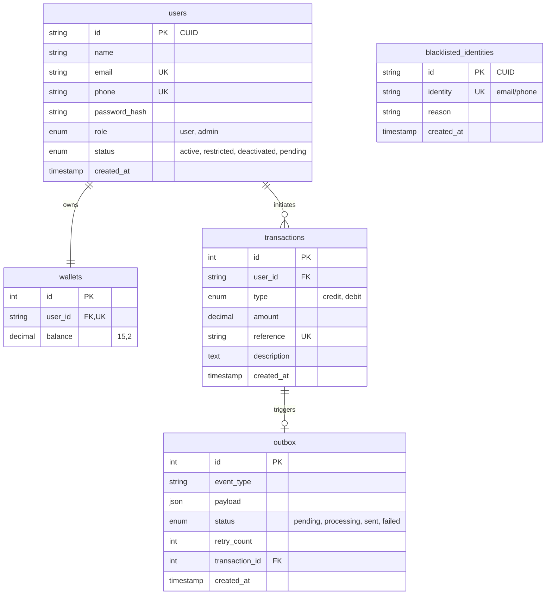

# Lendsqr Wallet MVP - Design Document

## 1. Project Overview
Demo Credit is a mobile lending application requiring robust wallet functionality. This service provides the Minimum Viable Product (MVP) core: user onboarding with automated blacklist verification, wallet funding, peer-to-peer transfers, and withdrawals.

### Core Features
- **Automated Onboarding**: New users are verified against the **Lendsqr Adjutor Karma API** in the background.
- **Early Blacklist Rejection**: Proactive check against local blacklist to immediately block repeat offenders.
- **Transaction Integrity**: Uses the **Outbox Pattern** with **Resend HTTP Email API** to ensure reliable data consistency between wallet balances and external notifications.
- **Wallet Operations**: Secure funding, transfers, and withdrawals with full ACID compliance.
- **Transaction History**: Comprehensive filtering and pagination for user and admin audit trails.

---

## 2. Technical Stack & Rationale
| Component | Technology | Rationale |
| :--- | :--- | :--- |
| **Language** | TypeScript | Type safety and enhanced developer productivity for financial logic. |
| **Framework** | NestJS (v11) | Structured patterns (DI, Modules) promoting high code quality and testability. |
| **Database** | MySQL 8.0 | Reliable, relational ACID-compliant storage for financial ledgers. |
| **Query Builder** | KnexJS | Assessment-preferred choice; provides granular SQL control and efficient migrations without the overhead of a heavy ORM. |
| **Auth** | JWT | Stateless, secure authentication strategy. |
| **ID Generation** | CUID2 | Secure, collision-resistant, and non-sequential identifiers (via `@paralleldrive/cuid2`). |

---

## 3. Database Architecture (E-R Diagram)
The schema is optimized for consistency and follow the **Outbox Pattern** for event-driven reliability.



---

## 4. Setup & Installation

### Prerequisites
- Node.js (LTS)
- MySQL 8.0 (Local or Docker)
- Adjutor API Key

### Configuration
1. Clone the repository and install dependencies:
   ```bash
   npm install
   ```
2. Create your `.env` file (see `.env.example`):
   ```bash
   cp .env.example .env
   ```
3. Run migrations to scaffold the database:
   ```bash
   npm run migrate
   ```

### Running the Application
```bash
# Development
npm run start:dev

# Production (Build & Start)
npm run build
npm run start:prod
```

### Testing
```bash
# Run unit tests (including positive/negative scenarios)
npm test
```

---

## 5. API Reference Summary

### System
- `GET /health`: Monitor API health and uptime.

### Onboarding & Auth
- `POST /auth/register`: Create account (triggers background Karma check).
- `POST /auth/login`: Authenticate and get JWT token.

### Wallet (Authorized)
*All routes require `Authorization: Bearer <token>`*
- `GET /wallet/balance`: Get current balance.
- `POST /wallet/fund`: Add funds to wallet.
- `POST /wallet/transfer`: Send funds to another user's email.
- `POST /wallet/withdraw`: Withdraw funds.
- `GET /wallet/transactions`: Filtered personal transaction history.

### Admin
- `GET /wallet/admin/transactions`: Global transaction audit log.

---

## 6. Deployment
The service is deployed at: `https://akanji-lawrence-lendsqr-be-test.onrender.com`

*Note: For detailed technical rationale and implementation details, please refer to [DOCUMENTATION.md](DOCUMENTATION.md).*
